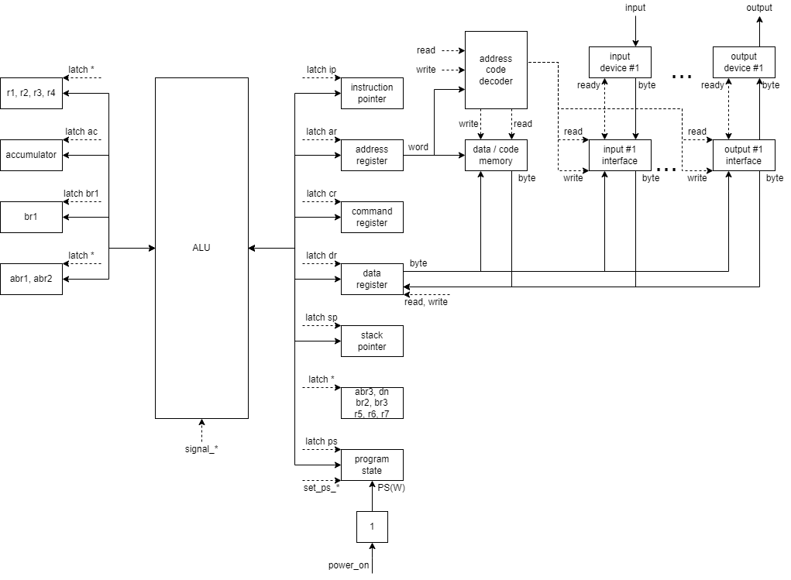
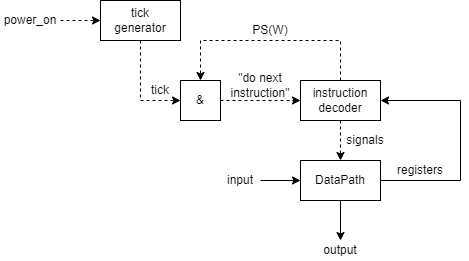

# Отчёт

- P33151, Шипулин Павел Андреевич.
- `asm | cisc | neum | hw | instr | binary | trap | mem | cstr | prob2 | spi`
- без усложнения 

## Язык программирования

### Описание синтаксиса
```ebnf
asm_program = { [ org | data_definition | instruction ] , empty_string }

empty_string = [ spaces ] , new_line ;

org = org , spaces , uint ;

instruction = 
  [ label , [ spaces ] ] , mnemonic , [ spaces , operands ] , [ [ spaces ] , comment ]

mnemonic = 
    "halt" | "clc" | "cmc" | "ei" | "di" |
    "ret" | "iret" | "not" | "neg" | "inc" | 
    "dec" | "sxt" | "swab" | jumps | "loop" |
    "push" | "pop" | "call" | "int" | "mov" |
    "and" | "or" | "xor" | "add" | "adc" |
    "sub" | "mul" | "div" | "mod" | "cmp" | "swap" ;
    
    
jumps =
    "jmp" | "je" | "jz" | "jne" | "jnz" |
    "jg" | "jge" | "ja" | "jae" | "jl" |
    "jle" | "jb" | "jc" | "jbe" | "js" |
    "jns" | "jnc" | "jv" | "jnv" ;

comment = ";" , characters ;

operands = operand , { listing_separator , operand };

operand = register | mem_addressing | complex_label ; 

mem_addressing = 
    "[" , mem_addressing_base , [ mem_addressing_index ] , [ mem_addressing_offset ] , "]" ;

mem_addressing_offset = [ sign ] , ( register | uint ) ;

mem_addressing_index = [ sign ] , ( register | uint ) , "*" , uint ;

sign = "-" | "+" ;

mem_addressing_base = register | number ;

data_definition = data_label , [ spaces ] , data_definition_without_label ;
data_definition_without_label = data_array | dup_directive ;

dup_directive = uint , spaces , "dup" , "(" , data_array , ")" ;
data_array = [ spaces ] , data_type , spaces , array_init ;
data_type = "byte" | "word" | "dword" ;

array_init = 
    ( int_sequence | string_sequence ) , { listing_separator , ( int_sequence | string_sequence ) }

int_sequence = int , { listing_separator , int } ;
string_sequence = string , { listing_separator , string } ;
listing_separator = [ spaces ] , "," , [ spaces ] ;

label = complex_label , ":" ;

complex_label = single_label , { relative_label };
relative_label = "." , single_label ;
single_label = [ "_" ] , name_word ;

general_register = "sp" | "r1" | "r2" | "r3" | "r4" | "r5" | "r6" | "r7" ;

string = single_quote , character , single_quote ;

name_word = letter , { letter | dec_digit } ;

letter = 
    "A" | "B" | "C" | "D" | "E" | "F" | "G" |
    "H" | "I" | "J" | "K" | "L" | "M" | "N" |
    "O" | "P" | "Q" | "R" | "S" | "T" | "U" |
    "V" | "W" | "X" | "Y" | "Z" | "a" | "b" |
    "c" | "d" | "e" | "f" | "g" | "h" | "i" |
    "j" | "k" | "l" | "m" | "n" | "o" | "p" |
    "q" | "r" | "s" | "t" | "u" | "v" | "w" |
    "x" | "y" | "z" ;
    
characters = { character } ;
character = <any except: "'", "\n"> ;
single_quote = "'" ;

spaces = { space };
space = " " | "\t" ;
new_line = "\n" ;

int = dec_int | hex_int ;
uint = dec_uint | hex_uint ;

hex_int = [ "-" ] hex_uint ;
hex_uint = "0x" , hex_uint_without_prefix ;
hex_uint_without_prefix = { hex_digit } ;
hex_digit = 
    "0" | "1" | "2" | "3" |
    "4" | "5" | "6" | "7" |
    "8" | "9" | "a" | "b" |
    "c" | "d" | "e" | "f" |
    "A" | "B" | "C" | "D" |
    "E" | "F" ;

dec_int = [ "-" ] dec_uint ;
dec_uint = { dec_digit } ;
dec_digit = 
    "0" | "1" | "2" | "3" |
    "4" | "5" | "6" | "7" |
    "8" | "9" ;
```

### Описание семантики

Код выполняется с метки `start`, так что её присутствие в коде обязательно для запуска программы.

Регистры общего назначения:
- `sp` -- указатель на стек
- `r1 - r7` -- буферные регистры для программиста 
  (если они не используются в инструкциях как аргументы чтения / записи, то они вообще не будут затронуты)
Директивы типов данных позволяют разместить по метке в памяти конкретные числа. 
Они также определяют то, к какому типу приводить результат операции, например --
сколько прочитать / записать в память?
Это удобно для выделения места под литералы или переменные.

Доступные директивы типов данных:
- `byte` -- размещение данных / операция размерностью 1 байт
- `word` -- 2 байта 
- `dword` -- 4 байта 

Память заполняется в соответствии с указанными в коде директивами `org`:
- `org <число>` -- разместить следующий байт-код по этому адресу
- программист может размещать память везде, где это может быть доступно (на адресах от `0` до `0xFFFF`)
- программист может определить метки обработчиков прерываний в адресах `0x00 - 0x10`
- программист может случайно затереть Memory Mapped IO и получить неожиданный результат

Директива `dup` позволяет повторить размещение данных некоторое количество раз:
- `n dup(data)` -- `n` раз повторить определение данных `data` в байт-коде

Ключевые слова:

- все регистры общего назначения
- все мнемоники (раздел 'Система команд. Набор инструкций')
- все директивы типов данных
- директивы `org` и `dup`

Любые символы после `;` (который не находится в литерале строчки `''`) трактуются как 
комментарий в строке (многострочных комментариев нет).

Литералы:
- целое число
  - десятичный
  - шестнадцатеричный
- строка
  - символьная запись -- `'[^']+'`
  - может быть представлена последовательностью чисел
  - переводится транслятором в последовательность байтов
  - программист должен сам ставить символ с кодом `0` в конце, если ему это нужно
  - нет специальных команд работающих со строками -- программист следит за этим сам

## Организация памяти

Устройство памяти -- общая память; машинное слово адреса -- 16 бит;
машинное слово данных -- 8 бит; знаковое; 
линейное адресное пространство; реализуется списком чисел.

Программисту доступны:
- регистры общего назначения:
  - `sp` -- Stack Pointer -- указатель на стек. 
    Используется для чтения / записи в память 'вниз'
  - `r1 - r7` -- буферные регистры
- буферы ввода и вывода:
  - память устройства памяти (все адреса кроме `0x10 <= AR < 0x14`)
  - байт статус (чтение / запись), байт данных (чтение) устройства ввода
  - байт статус (чтение / запись), байт данных (запись) устройства вывода

Специальные регистры, которые не доступны по имени:
- `ps` -- Program State (`0 | w | i | ei | n | z | v | c`):
  - `w == 1` => машина работает
  - `i == 1` => выполняется прерывание
  - `ei == 1` => прерывания разрешены
  - `n == 1` => если ALU выставило флаг `n` и старший бит результата равен `1`
  - `z == 1` => если ALU выставило флаг `z` и результат равен `0`
  - `v == 1` => если ALU выставило флаг `v` и было переполнение
  - `c == 1` => если ALU выставило флаг `c` и был перенос в бит за старшим
- `ar` -- Address Register, указывает по какому адресу обращаться к памяти
- `cr` -- Command Register, директива и код команды
- `dr` -- Data Register, указывает какие данные нужно передать устройствам памяти, ввода / вывода
- `dn` -- Destination, является буфером адреса для инструкций 
- `abr1 - abr3` -- Address Buffer Register, являются буферами, 
  необходимы для подсчета и хранения адреса обращения к памяти. 
  Используются для чтения / записи в память 'вверх'
- `ac` -- Accumulator, является буфером результата операций для инструкций
- `br1 - br3` -- Buffer Register, являются буферами, 
  необходимы для подсчета и хранения промежуточного результата инструкций
- `ip` -- Instruction Pointer, в начале такта указывает на адрес следующей инструкции. 
  Передается в `AR`, увеличивается на 1 в начале такта. 
  Заменяется на аргумент перехода при выполнении соответствующей инструкции. 
  Используется для чтения / записи в память 'вверх'

AddressCodeDecoder -- получает на вход сигналы чтения/записи и адрес `AR` который нужно декодировать.
Адреса `0x0010` и `0x0011` декодируются в буфер для устройства ввода.
Адреса `0x0012` и `0x0013` декодируются в буфер для устройства вывода.
Сигналы:
- `read`
  - `0x10` -- байт статуса устройства ввода поместится в нижний байт `DR`
    - `0` когда процессор готов
    - `1` когда устройство ввода готово отдать еще байт данных
  - `0x11` -- байт данных устройства ввода поместится в нижний байт `DR`
  - `0x12` -- байт статуса устройства вывода поместится в нижний байт `DR`
    - `0` когда процессор готов
    - `1` когда устройство вывода готово получить еще байт данных
  - `0x13` -- нижний байт `DR` не изменится (нельзя читать из вывода)
- `read` всегда завершается записью буфера ввода в `DR`

- `write` всегда начинается записью `DR` в нижний байт `DR`
  - `0x10` -- нижний байт `DR` поместится в байт статуса устройства ввода
  - `0x11` -- байт данных устройства не изменится (нельзя писать во ввод)
  - `0x12` -- нижний байт `DR` поместится в байт статуса устройства вывода
  - `0x13` -- нижний байт `DR` поместится в байт данных устройства вывода

### Во время компиляции

Данные (они же: инструкции, литералы, переменные, ...) превращаются в байт-код.
При этом, подсчитываются адреса меток и подставляются как `word` значения 'Immediate = на месте'

У каждой инструкции определяется тип данных аргументов 
(наименьшая директива которая указана, по-умолчанию -- `word`).
Если это не `word`, то перед кодом инструкции запишется код директивы.

`Source`-аргументы инструкции (числа, метки, чтение из памяти) приводятся к типу данных инструкции, 
либо теряя старшие байты, либо дополняя их (нулями -- если положительное, единицами -- если отрицательное).

Байт-код собирается в `.o` файл, который содержит:
- заголовок:
  - уникальное значение
  - `word` адрес метки `start`
  - `word` количество последовательностей кодов
- тело:
  - адрес, куда разместить следующие байты
  - количество байтов для размещения
  - сами байты данных

Также генерируется `.debug` файл:
- заголовок:
  - уникальное значение
  - `word` адрес метки `start`
  - `word` количество последовательностей кодов
- тело:
  - адрес, куда разместить следующие байты
  - байт-код
  - воспринятая мнемоника терма

### Подготовка к исполнению

Читается объектный файл `.o`, байт-код размещается в устройстве памяти машины.

Адрес метки `start` помещается в `IP`

### Во время выполнения

Данные (интерпретируются как инструкции или данные) могут быть прочтены/записаны из/в нижний байт `DR` из/в
устройства ввода, вывода, памяти.

Динамических данных как таковых -- нет, данные могут быть прочтены или записаны
по любому* адресу (нет областей видимости).

Статические данные -- размещаются в любом* адресе

Порядок работы машины:
- Байт по `IP` интерпретируется как директива (тогда придется прочитать еще байт) 
  или инструкция (тогда директива данных автоматически `word`).
- Выполнение инструкции может содержать:
  - чтение аргументов (в скрытые буферы `ac, br1 - br3`, возможно на лету вместе с подсчетом результата -- инструкция `lcomb`)
    - число на месте
    - код регистра
    - адресация памяти (для неё аргументы читаются в `abr1 - abr3`):
      - `[ri]` -- прямая (число, регистр)
      - `[ri+-ri]` -- со смещением
      - `[ri+-ri*s]` -- с индексом и размером элементов `s` байт
      - `[ri+-ri*s+-ri]` -- с индексом и смещением
  - подсчет результата (в скрытые буферы `ac, br1 - br3`)
  - запись результата куда требуется (регистр или адресацию памяти)
  
Данный раздел является сквозным по отношению к работе и должен включать:
- модель памяти процессора, размеры машинного слова, варианты адресации;
- механику отображения программы и данных на процессор.

## Система команд

Особенности процессора:

- Размеры регистров:
  - 32 бит:
    - `r1 - r7`
    - `dr, ac, br1 - br3`
  - 16 бит:
    - `sp`
    - `cr, ip, ar, dn, abr1 - abr3`
  - 8 бит:
    - `ps`
- Типы данных:
  - `byte` -- 1 байт на литерал
  - `word` -- 2 байта на литерал
  - `dword` -- 4 байта на литерал

### Набор инструкций

- без аргументов:
    - `halt` -- остановка
    - `clc` -- `PS(C) = 0`
    - `cmc` -- `PS(C) = 1 - PS(C)`
    - `ei` -- `PS(EI) = 1`
    - `di` -- `PS(EI) = 0`
    - `ret` -- записать в `IP` со стека адрес возврата
    - `iret` -- то же самое что `ret`, только еще `PS(I) = 0`

- 1 аргумент (`d = 'destination'` -- регистр или адресация памяти, `s = 'source'` -- число, регистр или адресация памяти):
    - `not d` -- прочитать `d`, записать НЕ `d` в `d`
    - `neg d` -- прочитать `d`, записать `-d` в `d`
    - `inc d` -- прочитать `d`, записать `d + 1` в `d`
    - `dec d` -- прочитать `d`, записать `d - 1` в `d`
    - `sxt d` -- расширить знак `d`
    - `swab d` -- поменять байты (или слова) местами в `d`
    - `jmp s` -- `IP = s`
    - `je s` / `jz s` -- `IP = s` если `PS(Z) == 1`
    - `jne s` / `jnz s` -- `IP = s` если `PS(Z) == 0`
    - `jg s` -- `IP = s` если `PS(N) == PS(V) и PS(Z) == 0`
    - `jge s` -- `IP = s` если `PS(N) == PS(V) или PS(Z) == 1`
    - `ja s` -- `IP = s` если `PS(C) == 0 и PS(Z) == 0`
    - `jae s` -- `IP = s` если `PS(N) == PS(V) или PS(Z) == 1`
    - `jl s` -- `IP = s` если `PS(N) != PS(V)`
    - `jle s` -- `IP = s` если `PS(N) != PS(V) или PS(Z) == 1`
    - `jb s` / `jc s` -- `IP = s` если `PS(C) == 1`
    - `jbe s` -- `IP = s` если `PS(C) == 1 или PS(Z) == 1`
    - `js s` -- `IP = s` если `PS(N) == 1`
    - `jns s` -- `IP = s` если `PS(N) == 0`
    - `jnc s` -- `IP = s` если `PS(C) == 0`
    - `jv s` -- `IP = s` если `PS(V) == 1`
    - `jnv s` -- `IP = s` если `PS(V) == 0`
    - `loop d` -- прочитать `d`, записать `d - 1` в `d`, если `d <= 0`, то `IP = IP + 1`
    - `push s` -- записать `s` на стек
    - `pop d` -- записать в `d` значение со стека
    - `call s` -- записать `IP` на стек, затем `IP = s`
    - `int s` -- если `PS(EI) == 1`, то записать `IP` на стек, затем `IP = s << 1`,`PS(I) = 1`

- 2 аргумента:
    - `mov d, s` -- записать `s` в `d`
    - `and d, s` -- записать `d and s` в `d`
    - `or d, s` -- записать `d xor s` в `d`
    - `xor d, s` -- записать `d xor s` в `d`
    - `add d, s` -- записать `d + s` в `d`
    - `adc d, s` -- записать `d + s + PS(C)` в `d`
    - `sub d, s` -- записать `d - s` в `d`
    - `mul d, s` -- записать `d * s` в `d`
    - `div d, s` -- записать `d / s` в `d`
    - `mod d, s` -- записать `d mod s` в `d`
    - `cmp s1, s2` -- выставить флаги по операции `sub s1, s2`
    - `swap d1, d2` -- поменять значения `d1` и `d2` местами

- n аргументов:
    - `lcomb RM (, RIM, RIM)*` -- принимает строго нечетное число аргументов, 
      записать в первый аргумент его плюс перемножения пар следующих
      `d = d + s_i * s_i+1` где `i = 1, n-1, +2`

### Кодирование инструкций

- Метки приписываются следующей инструкции или размещению данных.
- Размещение данных представляет собой последовательность байт-кодов.
- Структура закодированной инструкции представляет собой переменную последовательность байт-кодов:
  - 1 байт директивы (может быть пропущен, так как по-умолчанию `word`):
    - `byte == 0xFF` 
    - `word == 0xFE` -- не используется
    - `dword == 0xFD`
  - 1 байт-код операции (описаны в классе [InstructionSet](python/isa.py))
  - если это операция с переменным числом аргументов, то:
    - 1 байт-код количества (без знака) аргументов -- значение в промежутке `0x00 - 0xFF`
  - 1 байт-код на тип текущего аргумента:
    - `i = Immediate == 0xFF` -- прочитать значение дальше в памяти
    - `r = Register == 1 | 0 | 0 | 0 | 0 | x | x | x` -- аргумент это регистр общего назначения 
      (его код в младших 3 бит)
    - `m = Memory == 0 | 1 | is | os | s | s | i | o` -- аргумент это ячейка памяти:
      - `o == 1` -- есть смещение
      - `i == 1` -- есть индекс и размер элемента 
      - `2 ^ ss` -- количество байт в элементе (`0 <= ss <= 2`)
      - `os == 1` -- взять отрицательное смещение (хз зачем) 
      - `is == 1` -- взять отрицательный индекс (хз зачем)
  - переменно закодированный аргумент:
    - `?` байт для значения на месте -- зависит от директивы 
    - `0` байт для регистра -- необходимый регистр записан в типе аргумента
    - `?` байт для адресации -- зависит от директивы / типа адресации
      / кодов последующих аргументов (число, регистр)

## Транслятор

Интерфейс командной строки: `translator.py <input_file> <target_file>`

Реализовано в модуле: [translator](python/translator.py)

Этапы трансляции (функция `translate`):
1. Преобразование текста программы в список организации памяти, инструкций и размещений данных.
2. Подсчет адресов для меток, инструкций и кода, на основе директивы `org`. 
   Превращение инструкций и данных в байт-коды.
3. Подстановка адресов меток как значений 'на месте'.
4. Проверка перекрытия данных друг другом (из-за некорректного использования `org`).
5. Запись байт-кода программы в объектный файл и в файл с дополнительной информацией.

Правила генерации машинного кода:
- Транслятор удаляет комментарий в строке
- Транслятор по очереди пытается понять строку как:
  - использование директивы `org`:
    - поиск шаблона `org <number>`, приведение аргумента к `word`
  - определение данных в память по директивам типов данных:
    - поиск шаблона `<label>? <directive> <data>`
    - метка записывается в словарь меток по правилу записи локальных меток
    - данные представляются в виде последовательностей байт-кодов
  - использование инструкции:
    - поиск шаблона `<label>? <mnemonic> <args>?`
    - метка записывается в словарь меток по правилу записи локальных меток
    - аргументы представляются в виде последовательностей байт-кодов
  - метку без ничего
    - метка записывается в словарь меток по правилу записи локальных меток

## Модель процессора

Интерфейс командной строки: `machine.py <machine_code_file> <input_file>`

Реализовано в модуле: [machine](python/machine.py).

### DataPath



Реализован в классе `DataPath`.

`memory` -- `Memory Mapped I/O`, для обращения к устройствам используется AddressCodeDecoder.

Сигналы (реализованы в виде методов класса `DataPath`):
- `latch_*` -- записать в регистр значение с ALU.
- `read` -- записать значение в памяти по адресу `AR` в `DR`:
  - AddressCodeDecoder разбирается, откуда передать значение в буфера ввода 
  - передать байт из буфера ввода в `DR[7..0]`
- `write` -- записать выбранное значение в память по адресу `AR`:
  - передать `DR[7..0]` в буфер вывода
  - AddressCodeDecoder разбирается, куда передать значение из буфера вывода

Содержит в себе ALU:
- `left` и `right` -- значения на левом и правом входах
- флаги `n`, `z`, `v` и `c` промежуточного результата
- методы `signal_set_*` -- установить значение регистра на входе. 
  Регистры расположены слева и справа от ALU, поэтому одному регистру -- один метод либо 'слева', либо 'справа'.
- метод `signal_sxt` -- ставит флаг расширения знака байта (или слова) результата
- остальные методы `signal_*` -- выполнить операцию на ALU, 
  расширить (или нет) знак результата, записать результат в `result`
- остальные методы для внутреннего управления

### ControlUnit



Реализован в классе [ControlUnit](python/machine.py).

- Hardwired (реализовано полностью на Python) в управляющих виде сигналов для DataPath.
- метод `decode_and_execute_instruction` -- моделирует выполнение полного цикла инструкции.
- метод `instruction_tick_gen` -- вызывает выполнение `decode_and_execute_instruction`, 
  продвигает время моделирования на 1 инструкцию
- вспомогательные внутренние методы для сокращения кода

Особенности работы модели:

- Цикл симуляции осуществляется в функции `simulation`.
- Шаг моделирования соответствует одной инструкции с выводом состояния в журнал.
- Для журнала состояний процессора используется стандартный модуль `logging`.
- Количество инструкций для моделирования лимитировано.
- Остановка моделирования осуществляется:
    - при превышении предела количества выполняемых инструкций;
    - при исключении `StopIteration` -- если выполнена инструкция `halt`.
    - при прочих исключениях -- если код выполнился с ошибкой и вызвал исключение.

## Тестирование

В качестве тестов использовано два алгоритма (в задании 3 + алгоритм по варианту):

1. [hello world](python/golden/hello.yml).
2. [cat](python/golden/cat.yml) -- программа `cat`, повторяем ввод на выводе.
3. [hello user name](python/golden/hello_user_name.yml) -- пишет `Whats your name? Hello, <ввод>!`.
4. [prob2](python/golden/prob2.yml) -- выводит сумму четных чисел Фибоначчи значение которых не больше 4000000. `Answer: <число>`.
5. [lcomb](python/golden/lcomb.yml) -- выводит сумму 'c_0 + c_1x_1 + c_2x_2'

Интеграционные тесты реализованы [тут](python/golden_test.py) через golden tests,
конфигурация которых лежит в папке [golden](python/golden)

CI:

``` yaml
name: Python CI

on:
  push:
    branches:
      - main
    paths:
      - ".github/workflows/*"
      - "python/**"
  pull_request:
    branches:
      - main
    paths:
      - ".github/workflows/*"
      - "python/**"

defaults:
  run:
    working-directory: ./python

jobs:
  test:
    runs-on: ubuntu-latest

    steps:
      - name: Checkout code
        uses: actions/checkout@v4

      - name: Set up Python
        uses: actions/setup-python@v4
        with:
          python-version: 3.11

      - name: Install dependencies
        run: |
          python -m pip install --upgrade pip
          pip install poetry
          poetry install

      - name: Run tests and collect coverage
        run: |
          poetry run coverage run -m pytest .
          poetry run coverage report -m
        env:
          CI: true

  lint:
    runs-on: ubuntu-latest

    steps:
      - name: Checkout code
        uses: actions/checkout@v4

      - name: Set up Python
        uses: actions/setup-python@v4
        with:
          python-version: 3.11

      - name: Install dependencies
        run: |
          python -m pip install --upgrade pip
          pip install poetry
          poetry install

      - name: Run Ruff linters
        run: |
          poetry run python -m ruff translator.py
          poetry run python -m ruff machine.py
          poetry run python -m ruff isa.py
```

где:

- `poetry` -- управления зависимостями для языка программирования Python.
- `coverage` -- формирование отчёта об уровне покрытия исходного кода.
- `pytest` -- утилита для запуска тестов.
- `ruff` -- утилита для форматирования и проверки стиля кодирования.

